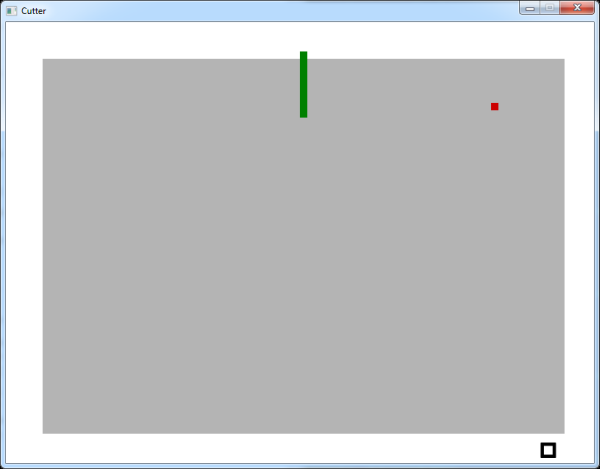

# Cutter

A game there you have to cut land without getting catched by the enemies.

### 3rd party libraries
The game uses for low level access to audio, keyboard, mouse, joystick, and graphics hardware
the SDL2 libraries.

- SDL2: https://www.libsdl.org
- SDL_ttf: https://www.libsdl.org/projects/SDL_ttf/
- SDL Image: https://www.libsdl.org/projects/SDL_image/

### Copyrights

Copyright 2016 David Roller

Licensed under the Apache License, Version 2.0 (the "License");
you may not use this file except in compliance with the License.
You may obtain a copy of the License at

 http://www.apache.org/licenses/LICENSE-2.0

Unless required by applicable law or agreed to in writing, software
distributed under the License is distributed on an "AS IS" BASIS,
WITHOUT WARRANTIES OR CONDITIONS OF ANY KIND, either express or implied.
See the License for the specific language governing permissions and
limitations under the License.
